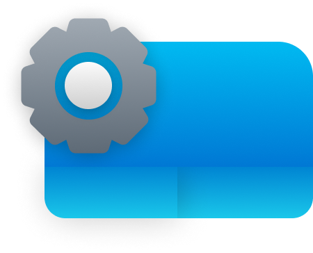

# SwipeTune

A Windows application that transforms your laptop touchpad into a powerful multimedia control center. Use gestures, swipes, and edge controls to manage volume, brightness, and more without interrupting your workflow.


## Features

- **System Tray Integration** - Runs quietly in the background with easy access from the system tray
- **Gesture Recognition** - Detects multi-touch gestures and swipe patterns
- **Volume Control** - Adjust volume with left edge gestures and pattern swipes
- **Brightness Control** - Control screen brightness with right edge gestures
- **Customizable Experience** - Toggle between different control modes

## Gesture Controls

### Basic Controls
- **Left Edge Touch & Hold**: Volume control slider
- **Right Edge Touch & Hold**: Brightness control slider
- **Middle Area Tap**: System notification

### Pattern Recognition
- **Clockwise Circle Pattern** (Up→Right→Down→Left→Up→Right→Down→Left): Increase volume by 15%
- **Counter-clockwise Circle Pattern** (Up→Left→Down→Right→Up→Left→Down→Right): Decrease volume by 15%

## How It Works

SwipeTune uses Windows Raw Input API to directly interact with your precision touchpad. The application:

1. Detects touchpad interactions including contact position, duration, and movement
2. Processes these inputs to identify gestures, swipes, and patterns
3. Maps recognized gestures to system controls like volume and brightness
4. Provides visual feedback about current operations

## System Requirements

- Windows 10 or later
- Precision Touchpad (most modern laptops)
- .NET Framework 4.8 or later

## Installation

1. Download the latest release from the [Releases](https://github.com/yourusername/SwipeTune/releases) page
2. Extract the ZIP file to a location of your choice
3. Run `SwipeTune.exe` to start the application
4. (Optional) Add to startup programs for automatic launch

## Building from Source

### Prerequisites
- Visual Studio 2019 or later
- .NET Desktop Development workload
- Windows 10 SDK

### Steps
1. Clone the repository:
   ```
   git clone https://github.com/yourusername/SwipeTune.git
   ```
2. Open `RawInput.Touchpad.sln` in Visual Studio
3. Restore NuGet packages
4. Build the solution

## Libraries Used

- **NAudio** - For audio device management
- **System.Management** - For brightness control

## Contributing

Contributions are welcome! Here are some ways you can contribute:

- Report bugs and request features by creating issues
- Improve documentation
- Submit pull requests with bug fixes or new features
- Add more gesture patterns and controls


## Future Enhancements

- [ ] Custom gesture mapping
- [ ] use touchpad as dial
- [ ] Media player controls (play/pause, next/previous)
- [ ] Application-specific gestures
- [ ] Gesture visualization and tutorial

## License

This project is licensed under the MIT License - see the [LICENSE](LICENSE) file for details.

## Acknowledgments

- Inspired by macOS trackpad gestures
- Special thanks to emoacht(RawInput Touchpad)
